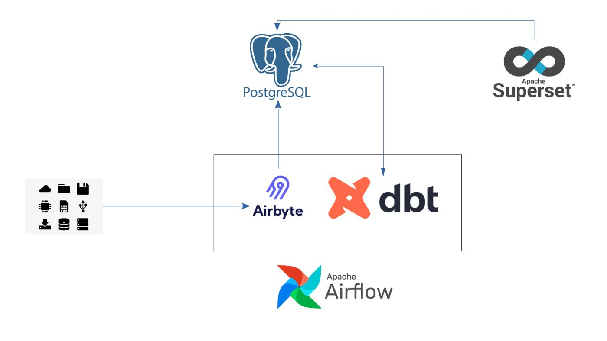

Hello everyone and we hope you are having a good day!

We try to give you all an insight about our data stack and choices that you can make for this course.

 
 

 
 

We wanted to provide a data stack for building a data warehouse with which you are able to implement the project, nevertheless it is you who can choose with which tools seting up your environment. The data stack is shown in the picture above and in the following you will learn more about it.

- Database:
  
  Speaking of which, you first of all need to have a database for storing your data as the original idea was using Bigquery on GCP, we thought it might be troublesome for you to setup the billing with your credit card in order to be able to use it, therefore we came up with an easy solution with Postgres running in docker. But feel free if you would like to set up Bigquery and dive into cloud engineering and if you fancy it (contact Amin Abbasloo for assisting you). Please keep in mind Bigquery sandbox won't allow you streaming so you need to set up billing!

- ETL:
  
  Loading and Extracting: in our stack, Airbyte handles these steps.
  
  Transforming: DBT is a conventional tool and it is a python library so hopefully you find it straightforward to use. It is worth-mentioning that Airbyte can also import BDT scripts and take care of transformation while loading the data.
  
- BI or datamart:
  
  Superset and Metabase are popular tools for the purpose but we found Metabase memory hungry for a local deployment, therefore our stack has Superset.  

- Links to access the UI's (first you need to run them in docker):
  
  http://localhost:8000 is Airbyte

  http://localhost:8088 is Superset

  http://localhost:5050 is pgAdmin

  http://localhost:8080 is Airflow

- Installing docker-compose:

  [Offical document](https://docs.docker.com/compose/install/)

  https://www.youtube.com/watch?v=VjUbSe8ONhs

